# Лабораторная работа №3 - Облако (Advanced). Вариант 2

## Работа с Terraform
1) Установим Terraform (пришлось немного повозиться с прокси, так как `apt` и `wget` капризничали, поэтому из официальной инструкции с первого раза ничего не получилось и немного изменила под себя)
    ```
    curl --proxy https://127.0.0.1:example_port -O - https://apt.releases.hashicorp.com/gpg | sudo gpg --dearmor -o /usr/share/keyrings/hashicorp-archive-keyring.gpg
    echo "deb [arch=$(dpkg --print-architecture) signed-by=/usr/share/keyrings/hashicorp-archive-keyring.gpg] https://apt.releases.hashicorp.com $(grep -oP '(?<=UBUNTU_CODENAME=).*' /etc/os-release || lsb_release -cs) main" | sudo tee /etc/apt/sources.list.d/hashicorp.list
    sudo apt update && sudo apt install terraform
    ```
    
    Разворачивать Terraform буду на KVM, так как он уже установлен и настроен на моем компьютере, а также позволяет создавать виртуальные машины с помощью Terraform. Для этого запустим и активируем демон `libvirtd`
    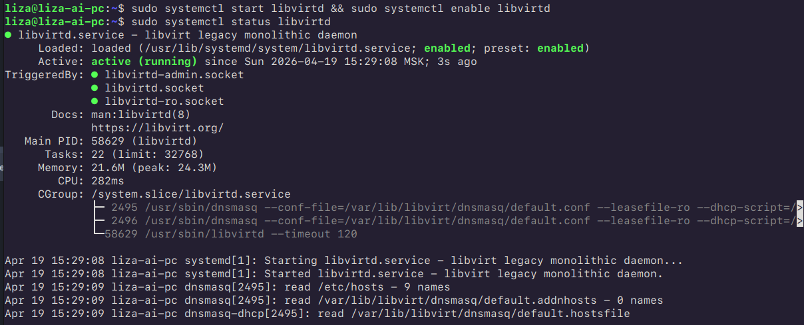
2) Настройка конфигурационных файлов Terraform для создания виртуальной машины с помощью провайдера `libvirt`. Создадим файл `main.tf` со следующим содержимым:
    ```
    cat main.tf
    terraform {
      required_providers {
        libvirt = {
          source = "dmacvicar/libvirt"
            version = "0.6.14"
        }
      }
    }
    
    provider "libvirt" {
      ## Configuration options
      uri = "qemu:///system"
    }
    ```
    
    В этом файле мы определяем провайдера `libvirt` (так как его нет в списке провайдеров Terraform, но добрые контрибьютеры уже сделали поддержку за нас, указываем версию `dmacvicar/libvirt`), а также указываем URI для подключения к демону `libvirtd`, который управляет виртуальными машинами на компьютере (в общем, автоматическая установка KVM-провайдера).
    
    Инициализируем среду командой `terraform init`, которая загрузит необходимые провайдеры и подготовит рабочую директорию для дальнейшей работы с Terraform.
    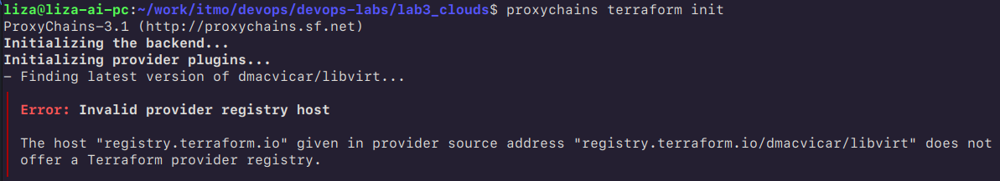

    Бороться с прокси не будем и воспользуемся зеркалом от Яндекса, для этого сделаем следующее:
    ```
    vim ~/.terraformrc
    provider_installation {
      network_mirror {
        url = "https://terraform-mirror.yandexcloud.net/"
        include = ["registry.terraform.io/*/*"]
      }
      direct {
        exclude = ["registry.terraform.io/*/*"]
      }
    }
   ```
   
    После этого снова запустим `terraform init` и убедимся, что провайдер `libvirt` успешно загружен (здесь с `-upgrade`, так как внесла версию чуть позже).
    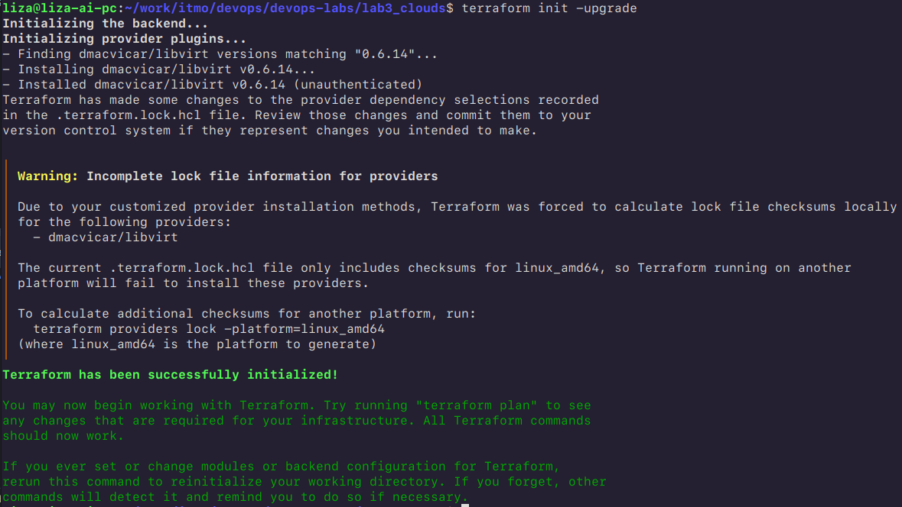
    Победа!

3)  Для дальнейшей работы посмотрим названия существующего пула и сети, которые нам понадобятся для создания виртуальной машины. Для этого воспользуемся командами `virsh pool-list` и `virsh net-list` соответственно:
    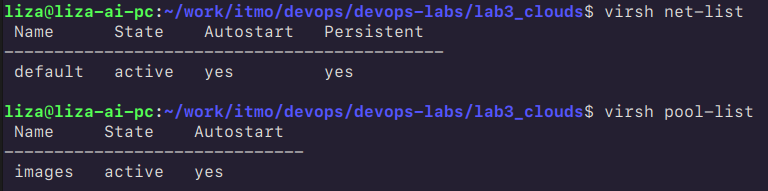
    Теперь создадим файл `libvirt.tf` для описания виртуальной машины, которую мы хотим создать. Создадим виртуальную машину с Ubuntu 22.04, 2 ГБ оперативной памяти, 2мя виртуальными ядрами и 15 ГБ дискового пространства:
    
    ```
    vim libvirt.tf
    
    resource "libvirt_volume" "base" {
      name   = "ubuntu-base.qcow2"
      pool   = "images"
      source = "https://cloud-images.ubuntu.com/jammy/current/jammy-server-cloudimg-amd64.img"
    }
    
    resource "libvirt_volume" "ubuntu-qcow2" {
      name           = "ubuntu.qcow2"
      pool           = "images"
      base_volume_id = libvirt_volume.base.id
      size           = 16106127360
    }
    
    resource "libvirt_cloudinit_disk" "commoninit" {
      name = "commoninit.iso"
      pool = "images"
      user_data = templatefile("${path.module}/cloud_init.cfg", {
    ssh_key = file("~/.ssh/id_rsa.pub")
      })
    
      meta_data = <<EOF
    instance-id: ubuntu-01
    local-hostname: ubuntu
    EOF
    }
    
    resource "libvirt_domain" "ubuntu" {
      name   = "ubuntu"
      memory = "2048"
      vcpu   = 2
    
      network_interface {
        network_name = "default"
        wait_for_lease = true
      }
    
      disk {
        volume_id = "${libvirt_volume.ubuntu-qcow2.id}"
      }
    
      cloudinit = "${libvirt_cloudinit_disk.commoninit.id}"
    
      console {
        type = "pty"
        target_type = "serial"
        target_port = "0"
      }
    
      graphics {
        type = "spice"
        listen_type = "address"
        autoport = true
      }
    }
    
    output "ip" {
      value = "${libvirt_domain.ubuntu.network_interface.0.addresses.0}"
    }
    ```

    Также для доступа к ВМ по `ssh` надо сделать дополнительный файл `cloud_init.cfg` с конфигурацией `cloud-init`, который будет использоваться для настройки виртуальной машины при первом запуске (генерируем `ssh-key` с помощью команды `ssh-keygen -t rsa -b 4096`):
   
    ```
    vim cloud_init.cfg
    
    users:
      - name: liza
        ssh_authorized_keys:
          - ${ssh_key}
        sudo: ['ALL=(ALL) NOPASSWD:ALL']
        shell: /bin/bash
        groups: sudo
   
    ssh_pwauth: false
   
    write_files:
      - path: /etc/ssh/sshd_config.d/99-disable-password.conf
        content: |
          PasswordAuthentication no
          KbdInteractiveAuthentication no
    
    growpart:
      mode: auto
   
    resize_rootfs: true
    ```
    
4)  Установим пакет для сборки ISO-образов:
    ```
    sudo apt install genisoimage
    ```
    Теперь запустим команду `terraform plan`, чтобы убедиться в корректности настроек, и затем `terraform apply`, которая создаст виртуальную машину на основе описанных ресурсов.
    
    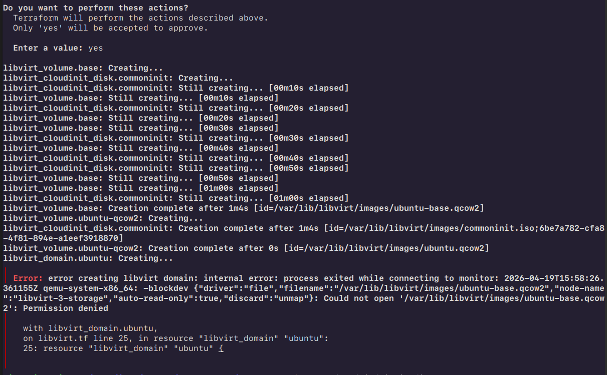
    При выполнении столкнулась с такой ошибкой. Выдадим права на чтение файла:
    ```
    sudo chown -R libvirt-qemu:kvm /var/lib/libvirt/images
    sudo chmod -R 770 /var/lib/libvirt/images
    ```
    И снова запустим, предварительно удалив созданные ресурсы командой `terraform destroy` (так как они были созданы, но не запущены из-за ошибки):
    ```
    # Удалим текущий пул для корректной работы
    virsh pool-destroy images
    virsh pool-undefine images
    virsh pool-define-as images dir \
    --target /var/lib/libvirt/images
    
    # Собственно, создадим пул заново
    virsh pool-build images
    virsh pool-start images
    virsh pool-autostart images
    
    # Удалим созданные ресурсы, так как они были созданы, но не запущены из-за ошибки
    virsh list --all
     Id   Name     State
    -------------------------
    -    ubuntu   shut off
    
    virsh destroy ubuntu
    virsh undefine ubuntu --remove-all-storage
    sudo rm -f /var/lib/libvirt/images/ubuntu.qcow2
    sudo rm -f /var/lib/libvirt/images/ubuntu-base.qcow2
    sudo rm -f /var/lib/libvirt/images/commoninit.iso
    
    # В файле /etc/libvirt/qemu.conf пропишем security_driver = "none", user = "root" и group = "root", а затем перезапустим демон libvirtd
    sudo systemctl restart libvirtd
    
    terraform destroy
    terraform apply
    ```
    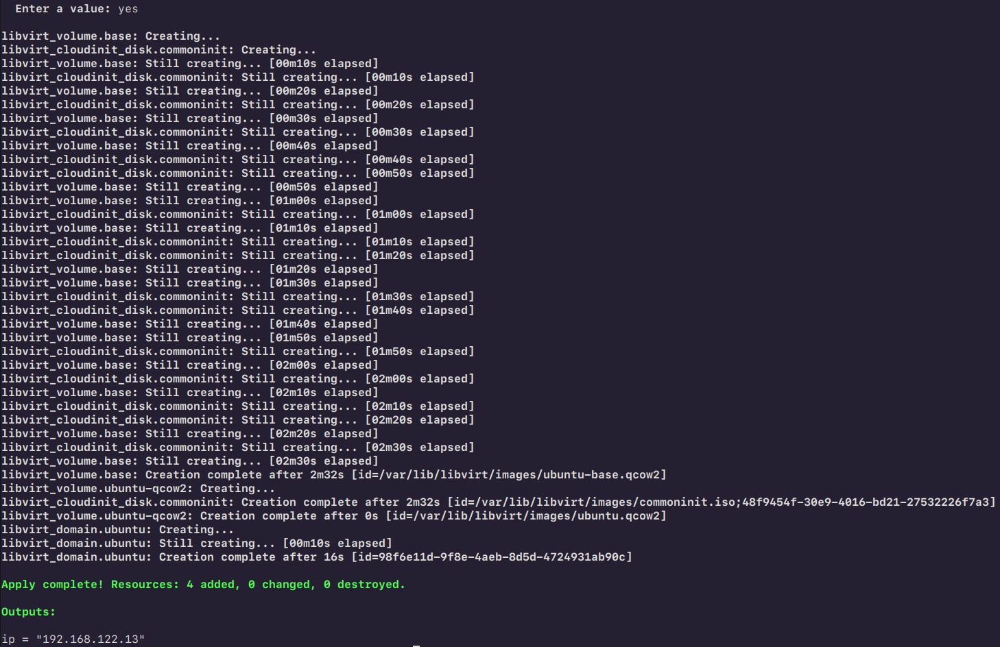
    
    Правки так с двадцатой получилось!!

    Проверим, что виртуальная машина успешно создана и запущена:
    
    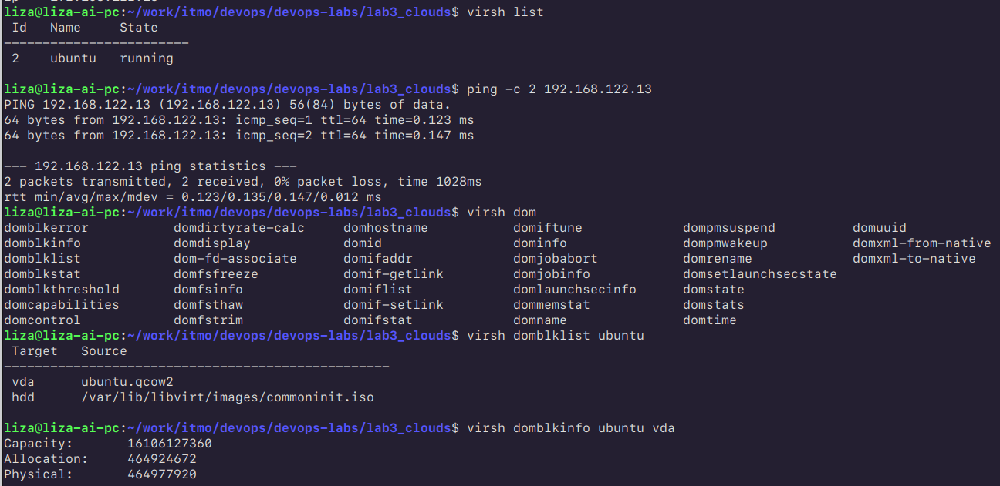
    
    Все доступно и создалось с заданными размерами оперативной памяти и диска.

6) Подключимся к ВМ по `ssh`:
    ```
    ssh liza@<IP_ADDRESS>
    ```
    И убедимся, что все работает корректно:
    
    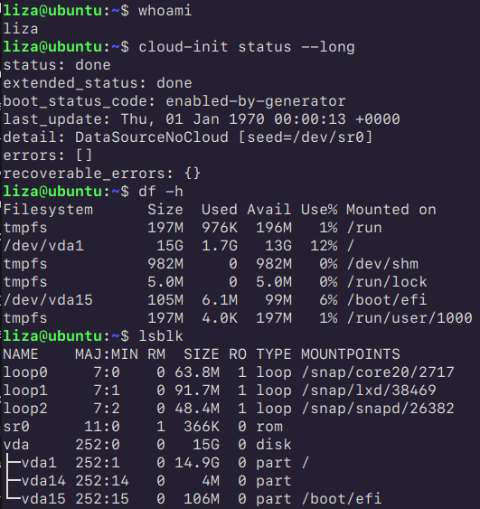
   
    Результаты команд внутри виртуалки также подтверждают корректность конфигурации!
    
## Внедрение Ansible и MinIO
   
1) Установим Ansible на локальную машину:
    ```
    sudo apt update
    sudo apt install ansible
    ```
2) Создадим инвентори-файл `hosts.ini` для Ansible, который будет содержать информацию о виртуальной машине. В моем случае это будет IP-адрес, который мы получили при создании виртуальной машины с помощью Terraform:
    ```
    vim hosts.ini
    [minio]
    <IP_ADDRESS> ansible_user=liza ansible_ssh_private_key_file=~/.ssh/id_rsa
    ```
3) Создадим `playbook` для установки MinIO на виртуальную машину. Создадим файл `minio-playbool.yml` со следующим содержимым:
    ```
    vim minio.yml
    - name: Install MinIO
      hosts: minio
      become: yes
    
      vars:
        minio_user: minio
        minio_group: minio
        minio_cnfg_dir: /opt/minio
        minio_data_dir: /mnt/minio
        minio_binary_path: /usr/local/bin/minio
        minio_url: https://dl.min.io/server/minio/release/linux-amd64/minio
        minio_port: 9000
        minio_console_port: 9001
    
    tasks:
    
        - name: Install dependencies
          apt:
            name:
              - curl
            state: present
            update_cache: yes
    
        - name: Create minio group
          group:
            name: "{{ minio_group }}"
            system: yes
    
        - name: Create minio user
          user:
            name: "{{ minio_user }}"
            system: yes
            group: "{{ minio_group }}"
            shell: /usr/sbin/nologin
            create_home: no
    
        - name: Create directories
          file:
            path: "{{ item }}"
            state: directory
            owner: "{{ minio_user }}"
            group: "{{ minio_group }}"
            mode: "0755"
          loop:
            - "{{ minio_cnfg_dir }}"
            - "{{ minio_data_dir }}"
    
        - name: Download MinIO binary
          get_url:
            url: "{{ minio_url }}"
            dest: "{{ minio_binary_path }}"
            mode: "0755"
    
        - name: Create systemd service
          copy:
            dest: /etc/systemd/system/minio.service
            content: |
              [Unit]
              Description=MinIO
              After=network.target
    
              [Service]
              User={{ minio_user }}
              Group={{ minio_group }}
              ExecStart={{ minio_binary_path }} server --address ":{{ minio_port }}" --console-address ":{{ minio_console_port }}" {{ minio_data_dir }}
              Restart=always
    
              [Install]
              WantedBy=multi-user.target
    
        - name: Reload systemd
          systemd:
            daemon_reload: yes
    
        - name: Enable and start MinIO
          systemd:
            name: minio
            enabled: yes
            state: started
    ```
4) Запустим `playbook` для установки MinIO на виртуальную машину:
    ```
    ansible-playbook -i hosts.ini minio-playbook.yml
    ```
   
    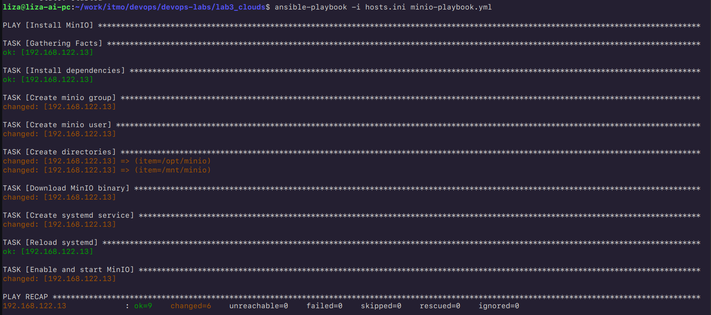

5) После успешного выполнения `playbook` проверим, что MinIO запущен и доступен по порту 9000:
    
    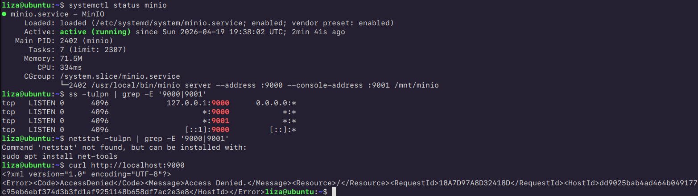
    Выполнение команд показывает активность сервера и его успешную работу :)

    Посмотрим с компьютера, что происходит при попытке доступа к MinIO через браузер по адресу `http://<IP_ADDRESS>:9001` (пароль и юзернейм я не задавала, так что по дефолту они эквивалентны `minioadmin`):
    
    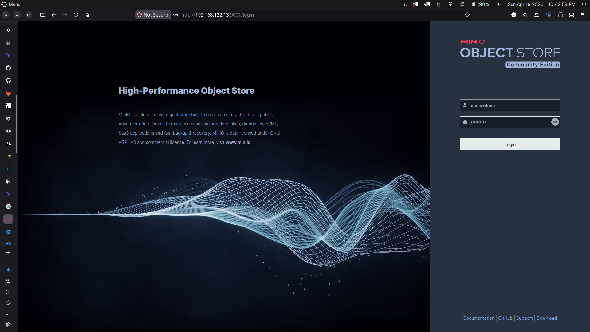
    
    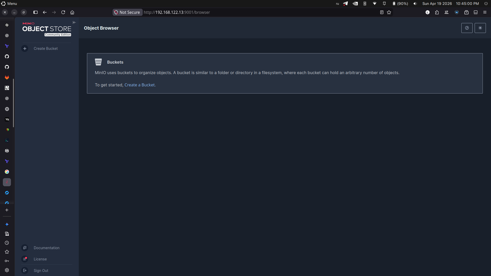
    И видим, что MinIO успешно запущен и доступен для использования!

6) Для проверки функциональности MinIO создадим бакет и загрузим в него файл. Для этого воспользуемся `mc` (MinIO Client), который можно установить на виртуальную машину:
    ```
    wget https://dl.min.io/client/mc/release/linux-amd64/mc
    chmod +x mc
    sudo mv mc /usr/local/bin/
    ```
    Теперь настроим `mc` для подключения к нашему MinIO серверу:
    ```
    mc alias set myminio http://127.0.0.1:9000 minioadmin minioadmin
    ```
    Создадим бакет и загрузим файл:
    ```
    mc mb myminio/mybucket
    echo "Hello, MinIO!" > hello.txt
    mc cp hello.txt myminio/mybucket/
    ```
    Проверим, что файл успешно загружен:
    ```
    mc ls myminio/mybucket/
    ```
    
    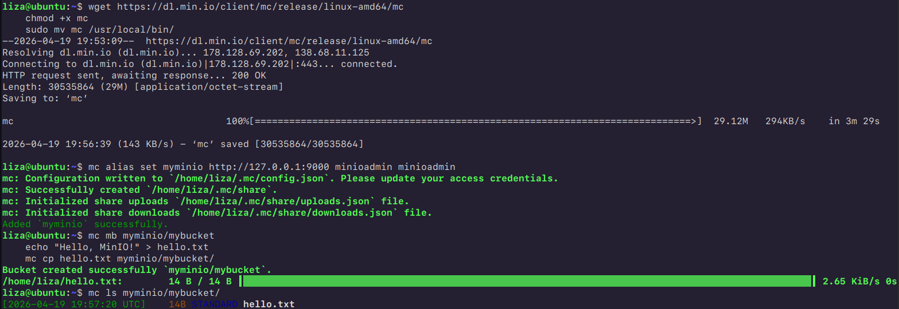
    И видим, что файл `hello.txt` успешно загружен в бакет `mybucket`, что подтверждает корректную работу MinIO!

    Напоследок проверим на сайте:
    
    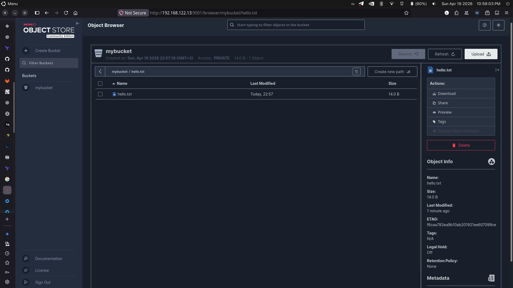
    И видим, что файл доступен для скачивания, что подтверждает его успешную загрузку в MinIO!
