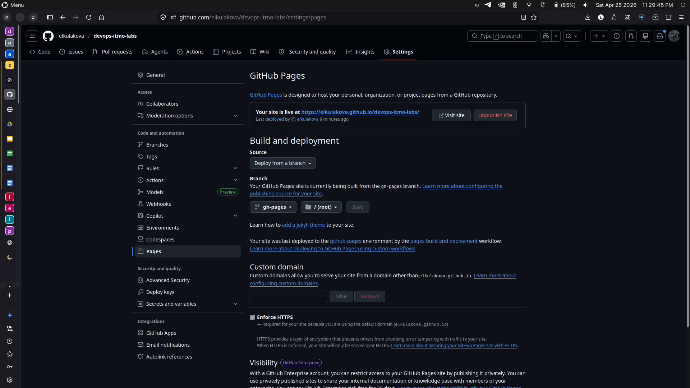
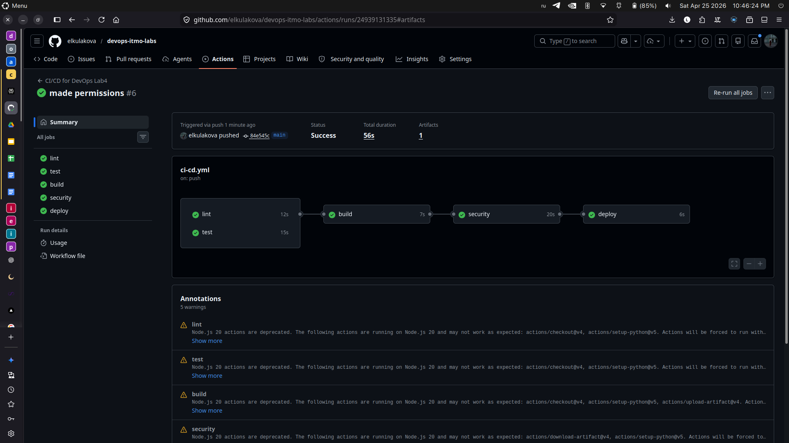
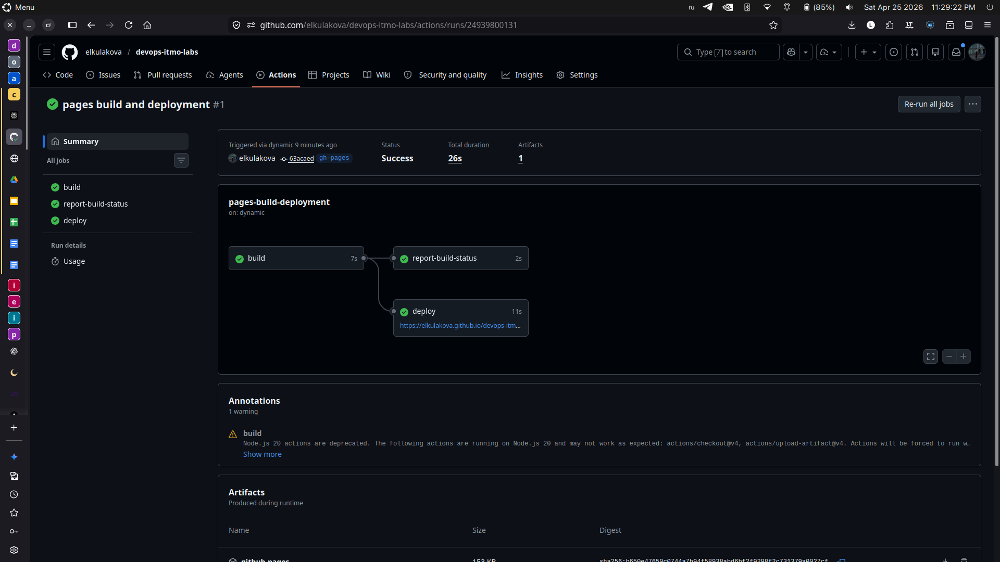
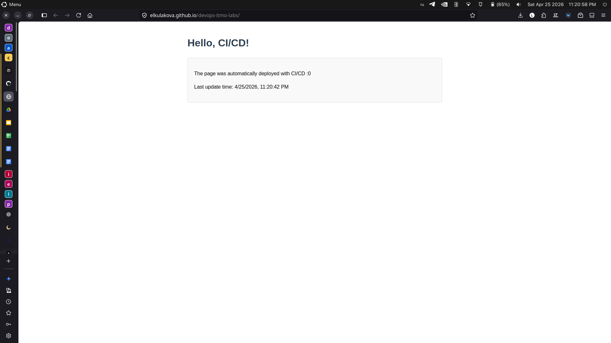
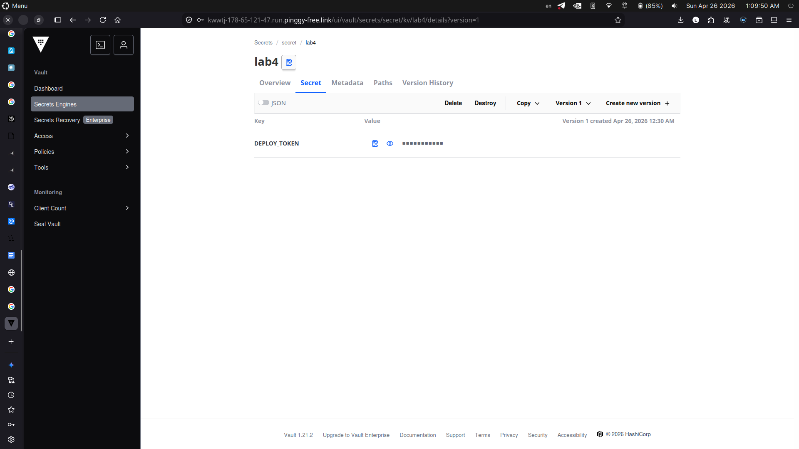

# Лабораторная работа №4. CI/CD

## Часть 1

Так как я работаю с `GitHub`, то буду рассматривать создаие `CI/CD-файла` для `GitHub Actions`. Будем считать, что данная папка `lab4_ci-cd` - это корень репозитория с нашим проектом, который мы хотим собирать, тестировать и деплоить.

### Плохой CI/CD-файл

```
vim .github/workflows/bad-practice.yml
name: CI/CD for DevOps Lab4

on:
  push:
    branches: [ main ] # 1. Хардкод ветки, что снижает гибкость (здесь оказалось по-другому никак и не написать :() + 2. Отсутствие ограничения на триггеринг pipeline только при изменении файлов проекта
  pull_request:
    branches: [ main ]

jobs:
  lint:
    runs-on: ubuntu-latest # 3. Использование latest версии ОС
    steps:
      - uses: actions/checkout@v4
      - name: Set up Python
        uses: actions/setup-python@v5
        with:
          python-version: '3.12' # 5. Отсутствие кэширования зависимостей
      - name: Lint with flake8
        working-directory: lab4_ci-cd
        run: |
          pip install flake8 # 3. Не указывать конкретную версию библиотеки
          flake8 . --count --select=E9,F63,F7,F82 --show-source --statistics
    timeout-minutes: 10
  
  test:
    runs-on: ubuntu-latest
    steps:
      - uses: actions/checkout@v4
      - name: Set up Python
        uses: actions/setup-python@v5
        with:
          python-version: '3.12'
      - name: Install Dependencies
        working-directory: lab4_ci-cd
        run: pip install -r requirements.txt
      - name: Run Tests
        working-directory: lab4_ci-cd
        run: python test.py
    timeout-minutes: 10
  
  build:
    runs-on: ubuntu-latest
    steps:
      - uses: actions/checkout@v4
      - name: Set up Python
        uses: actions/setup-python@v5
        with:
          python-version: '3.12'
      - name: Build Artifact
        run: |
          mkdir built-app
          rsync -av --exclude='.git' lab4_ci-cd/ built-app/
          ls -R built-app
      - name: Upload Build Artifact
        uses: actions/upload-artifact@v4
        with:
          name: python-app
          path: ./built-app
    timeout-minutes: 10

  security:
    runs-on: ubuntu-latest
    steps:
      - uses: actions/download-artifact@v4
        with:
          name: python-app
      - name: Set up Python
        uses: actions/setup-python@v5
        with:
          python-version: '3.12'
      - name: Security Scan (Bandit)
        run: |
          pip install pbr bandit # 3. Не указывать конкретную версию библиотеки
          bandit -r built-app
    timeout-minutes: 10

  deploy:
    environment: production
    if: github.ref == 'refs/heads/main' # 1. Хардкод ветки, что снижает гибкость
    runs-on: ubuntu-latest
    steps:
      - uses: actions/download-artifact@v4
        with:
          name: python-app
          path: built-app
      - name: Debug
        run: ls -R built-app
      - name: Show final structure
        run: find built-app
      - name: Deploy to GitHub Pages
        uses: peaceiris/actions-gh-pages@v4
        with:
          github_token: "top-Secret-token" # 6. Хардкод токена, что снижает безопасность
          publish_dir: ./built-app
    timeout-minutes: 10
```

Pipeline содержит ряд антипаттернов:
- использование хардкода значений (ветки и секретов): это снижает гибкость и безопасность, так как при изменении ветки или утечке токена придется менять код и может привести к проблемам с безопасностью;
- отсутствие фиксации версий зависимостей: это снижает воспроизводимость, так как при каждом запуске pipeline может использоваться разная версия библиотек, что может приводить к различиям в поведении и ошибкам;
- использование mutable окружений: использование `ubuntu-latest` может приводить к тому, что при каждом запуске pipeline будет использоваться разная версия ОС и предустановленных инструментов, что снижает воспроизводимость и может приводить к ошибкам;
- отсутствие структурированной зависимости между job-ами: это может приводить к тому, что этапы будут выполняться даже при провале предыдущих, что снижает эффективность и может приводить к ненужным затратам ресурсов;
- отсутствие кэширования зависимостей: это увеличивает время выполнения pipeline, так как при каждом запуске придется заново устанавливать все зависимости, что может быть особенно критично для больших проектов;
- отсутствие ограничения на триггеринг pipeline только при изменении файлов проекта, что может приводить к ненужным запускам при изменении документации или других несущественных файлов
- отсутствие dependency graph между job-ами, что может приводить к тому, что этапы будут выполняться даже при провале предыдущих

Это снижает воспроизводимость, безопасность и переносимость CI/CD процесса.

### Хороший CI/CD-файл

```
vim .github/workflows/ci-cd.yml
name: CI/CD for DevOps Lab4

on:
  push:
    branches: [ main ]
    paths:
      - 'lab4_ci-cd/**' # 2. Ограничение на триггеринг pipeline только при изменении файлов проекта
      - '!lab4_ci-cd/**.md'
  pull_request:
    branches: [ main ]
    paths:
      - 'lab4_ci-cd/**'
      - '!lab4_ci-cd/**.md'

jobs:
  lint:
    runs-on: ubuntu-22.04 # 3. Указание конкретной версии ОС
    steps:
      - uses: actions/checkout@v4
      - name: Set up Python
        uses: actions/setup-python@v5
        with:
          python-version: '3.12'
          cache: 'pip' # 5. Включение кэширования для зависимостей
      - name: Lint with flake8
        working-directory: lab4_ci-cd
        run: |
          pip install flake8==7.0.0 # 3. Указание конкретной версии библиотеки
          flake8 . --count --select=E9,F63,F7,F82 --show-source --statistics
    timeout-minutes: 10
          
  test:
    runs-on: ubuntu-22.04
    steps:
      - uses: actions/checkout@v4
      - name: Set up Python
        uses: actions/setup-python@v5
        with:
          python-version: '3.12'
          cache: 'pip'
      - name: Install Dependencies
        working-directory: lab4_ci-cd
        run: pip install -r requirements.txt
      - name: Run Tests
        working-directory: lab4_ci-cd
        run: python test.py
    timeout-minutes: 10
        
  build:
    needs: [lint, test] # 4. Явное указание зависимостей между job-ами
    runs-on: ubuntu-22.04
    steps:
      - uses: actions/checkout@v4
      - name: Set up Python
        uses: actions/setup-python@v5
        with:
          python-version: '3.12'
          cache: 'pip'
      - name: Build Artifact
        run: |
          mkdir built-app
          rsync -av --exclude='.git' lab4_ci-cd/ built-app/
          ls -R built-app
      - name: Upload Build Artifact
        uses: actions/upload-artifact@v4
        with:
          name: python-app
          path: ./built-app
    timeout-minutes: 10

  security:
    needs: build
    runs-on: ubuntu-22.04
    steps:
      - uses: actions/download-artifact@v4
        with:
          name: python-app
      - name: Set up Python
        uses: actions/setup-python@v5
        with:
          python-version: '3.12'
          cache: 'pip'
      - name: Security Scan (Bandit)
        run: |
          pip install pbr==6.1.1 bandit==1.7.5
          bandit -r built-app
    timeout-minutes: 10

  deploy:
    environment: production
    needs: security
    if: github.ref == format('refs/heads/{0}', github.event.repository.default_branch) # 1. Использование переменной для определения ветки
    runs-on: ubuntu-22.04
    steps:
      - uses: actions/download-artifact@v4
        with:
          name: python-app
          path: built-app
      - name: Debug
        run: ls -R built-app
      - name: Show final structure
        run: find built-app
      - name: Deploy to GitHub Pages
        uses: peaceiris/actions-gh-pages@v4
        with:
          github_token: ${{ secrets.GITHUB_TOKEN }} # 6. Использование встроенных секретов GitHub для токенов
          publish_dir: ./built-app
    timeout-minutes: 10
```

В этом файле я исправила все перечисленные антипаттерны, что повысило стабильность, безопасность и эффективность CI/CD процесса. Теперь pipeline будет более предсказуемым, безопасным и оптимизированным для проекта.
Как исправления повлияли на процесс:
- использование переменных для определения ветки позволяет легко менять ветку по умолчанию без необходимости менять код, что повышает гибкость;
- ограничение на триггеринг pipeline только при изменении файлов проекта снижает количество ненужных запусков, что экономит ресурсы и время;
- указание конкретных версий ОС и библиотек обеспечивает стабильность окружения и воспроизводимость результатов, что снижает вероятность ошибок из-за изменений в зависимостях;
- явное указание зависимостей между job-ами гарантирует правильный порядок выполнения и предотвращает выполнение этапов при провале предыдущих, что повышает эффективность; соблюдение принципа `fail-fast` позволяет быстрее обнаруживать и исправлять ошибки, что экономит время и ресурсы;
- включение кэширования для зависимостей значительно ускоряет выполнение pipeline, особенно для больших проектов, что улучшает производительность;
- использование встроенных секретов `GitHub` для токенов повышает безопасность, так как исключает риск утечки токенов через код и позволяет управлять доступом к секретам через интерфейс `GitHub`.

Попробуем запустить этот pipeline и убедиться, что он работает корректно. В настройках репозитория способ деплоя выбираем `Deploy from a branch`, вписываем в название ветки `gh-pages`, так как по файлу все будет деплоиться именно в новую ветку с таким названием (также в настройках надо выдать разрешения воркфлоуам на запись и чтение, а не только на запись):



Теперь запушу изменения в репозиторий. Если все этапы выполняются успешно, то мы можем быть уверены, что наш CI/CD процесс настроен правильно и эффективно:





Все стадии пройдены успешно, что подтверждает правильность настроек и исправлений в CI/CD файле. Теперь мы можем быть уверены, что наш процесс сборки, тестирования и деплоя работает стабильно, безопасно и эффективно.

А вот и сайт!



## Часть 2

Создание хранилища для артефактов и секретов в `GitHub` осуществляется через `GitHub Secrets` и `GitHub Packages`, но это не такая гибкая альтернатива, как использование специализированных инструментов для управления секретами и артефактами, таких как `HashiCorp Vault` или `AWS Secrets Manager` для секретов. Эти инструменты предоставляют более продвинутые функции безопасности, управления доступом и интеграции с CI/CD процессами, что делает их более подходящими для сложных проектов и организаций с высокими требованиями к безопасности.

Так как мы уже работали с `Kubernetes` и `Helm` во второй лабе, то как будто стоит применить эти навыки еще раз :)

```
minikube start
😄  minikube v1.38.1 on Ubuntu 24.04
✨  Using the docker driver based on existing profile
👍  Starting "minikube" primary control-plane node in "minikube" cluster
🚜  Pulling base image v0.0.50 ...
🔄  Restarting existing docker container for "minikube" ...
🐳  Preparing Kubernetes v1.35.1 on Docker 29.2.1 ...
🔎  Verifying Kubernetes components...
    ▪ Using image gcr.io/k8s-minikube/storage-provisioner:v5
    ▪ Using image docker.io/kubernetesui/dashboard:v2.7.0
    ▪ Using image docker.io/kubernetesui/metrics-scraper:v1.0.8
💡  Some dashboard features require the metrics-server addon. To enable all features please run:

	minikube addons enable metrics-server

🌟  Enabled addons: storage-provisioner, dashboard, default-storageclass
🏄  Done! kubectl is now configured to use "minikube" cluster and "default" namespace by default

kubectl create ns vault
namespace/vault created

cd vault-helm
helm install vault . --namespace vault --set "server.dev.enabled=true"
NAME: vault
LAST DEPLOYED: Sun Apr 26 00:09:16 2026
NAMESPACE: vault
STATUS: deployed
REVISION: 1
NOTES:
Thank you for installing HashiCorp Vault!

Now that you have deployed Vault, you should look over the docs on using
Vault with Kubernetes available here:

https://developer.hashicorp.com/vault/docs


Your release is named vault. To learn more about the release, try:

  $ helm status vault
  $ helm get manifest vault

kubectl get pods -n vault
NAME                                   READY   STATUS              RESTARTS   AGE
vault-0                                0/1     ContainerCreating   0          13s
vault-agent-injector-8c76487db-xj8xs   0/1     Running             0          14s
kubectl get pods -n vault
NAME                                   READY   STATUS              RESTARTS   AGE
vault-0                                0/1     ContainerCreating   0          29s
vault-agent-injector-8c76487db-xj8xs   1/1     Running             0          30s
kubectl get pods -n vault
NAME                                   READY   STATUS    RESTARTS   AGE
vault-0                                0/1     Running   0          37s
vault-agent-injector-8c76487db-xj8xs   1/1     Running   0          38s
kubectl get pods -n vault
NAME                                   READY   STATUS    RESTARTS   AGE
vault-0                                1/1     Running   0          79s
vault-agent-injector-8c76487db-xj8xs   1/1     Running   0          80s

kubectl get all -n vault
NAME                                       READY   STATUS    RESTARTS   AGE
pod/vault-0                                1/1     Running   0          3m22s
pod/vault-agent-injector-8c76487db-xj8xs   1/1     Running   0          3m23s

NAME                               TYPE        CLUSTER-IP       EXTERNAL-IP   PORT(S)             AGE
service/vault                      ClusterIP   10.105.192.58    <none>        8200/TCP,8201/TCP   3m23s
service/vault-agent-injector-svc   ClusterIP   10.103.191.158   <none>        443/TCP             3m23s
service/vault-internal             ClusterIP   None             <none>        8200/TCP,8201/TCP   3m23s

NAME                                   READY   UP-TO-DATE   AVAILABLE   AGE
deployment.apps/vault-agent-injector   1/1     1            1           3m23s

NAME                                             DESIRED   CURRENT   READY   AGE
replicaset.apps/vault-agent-injector-8c76487db   1         1         1       3m23s

NAME                     READY   AGE
statefulset.apps/vault   1/1     3m23s
```

Теперь у нас есть развернутый `Vault` в `Kubernetes`, который мы можем использовать для хранения секретов и управления ими в нашем CI/CD процессе. Мы можем настроить `Vault` для хранения наших секретов, таких как токены доступа, пароли и другие конфиденциальные данные, и интегрировать его с нашим CI/CD pipeline для безопасного доступа к этим данным во время сборки, тестирования и деплоя нашего приложения. При добавлении репозитория в `Helm` был указан флаг `server.dev.enabled=true`, что позволяет запустить `Vault` в режиме разработки, который не требует дополнительной настройки и позволяет быстро начать работу с `Vault` для тестирования и обучения. Однако для продакшн-окружения рекомендуется использовать более безопасную конфигурацию `Vault` с правильной настройкой аутентификации, авторизации и управления секретами (но для лабы сделаем так :)).

Теперь настроим хранилище так, чтобы мы могли использовать его для хранения секретов в нашем CI/CD процессе. Для этого нам нужно создать секреты в `Vault` и настроить наш CI/CD pipeline для доступа к этим секретам во время выполнения.

```
# заходим в кластер
kubectl exec -it vault-0 -n vault -- /bin/sh

# создаем секрет
vault kv put secret/lab4 DEPLOY_TOKEN="token-for-deploy"
== Secret Path ==
secret/data/lab4

======= Metadata =======
Key                Value
---                -----
created_time       2026-04-25T21:30:40.101470779Z
custom_metadata    <nil>
deletion_time      n/a
destroyed          false
version            1

vault kv list secret
Keys
----
lab4

exit
```

Секрет создан, теперь надо дать к нему доступ. Так как секрет и кластер находятся на локальной машине, то надо прорубить окно в мир, поэтому установим `ngrok`: там и безопасное HTTPS-соединение, и закрытие этого соединения просто через Ctrl+C, и вообще удобный инструмент для таких целей.

```
curl -sSL https://ngrok-agent.s3.amazonaws.com/ngrok.asc \
  | sudo tee /etc/apt/trusted.gpg.d/ngrok.asc >/dev/null \
  && echo "deb https://ngrok-agent.s3.amazonaws.com bookworm main" \
  | sudo tee /etc/apt/sources.list.d/ngrok.list \
  && sudo apt update \
  && sudo apt install ngrok
ngrok config add-authtoken NGROK_TOKEN

# в одном терминале запускаем ngrok для проброса порта 8200, на котором работает Vault
ngrok http 8200

# в другом терминале запускаем порт-форвардинг для доступа к Vault через localhost
kubectl port-forward service/vault -n vault 8200:8200
```

Уважаемый `ngrok` угнетает нас и не дает доступ 😭


Не отчаиваемся, удаляем предателя и ищем патриотичный аналог.

Запустим `pingy.io`:

```
ssh -p 443 -R 80:localhost:8200 a.pinggy.io

                                               You are not authenticated.                                               
 Your tunnel will expire in 60 minutes. Upgrade to Pinggy Pro to get unrestricted tunnels. https://dashboard.pinggy.io  
                                                                                                                        
                                                                                                                        
   http://kwwtj-178-65-121-47.run.pinggy-free.link                                                                      
   https://kwwtj-178-65-121-47.run.pinggy-free.link  
```

Испльзуем вторую ссылку с безопасным `https-соединением` и пробуем войти в `Vault`.
Получилось войти в хранилище! Вот наш токен



Теперь в репозитории `GitHub` в настройках проекта добавим секрет `VAULT_TOKEN` со значением нашего токена, а также `VAULT_URL` со значением `https://kwwtj-178-65-121-47.run.pinggy-free.link` (адрес нашего хранилища). Теперь мы можем использовать эти секреты в нашем CI/CD pipeline для доступа к `Vault` и получения наших секретов во время выполнения.

Обновленный `deploy-job` будет выглядеть так:
```
deploy:
    environment: production
    needs: security
    if: github.ref == format('refs/heads/{0}', github.event.repository.default_branch)
    runs-on: ubuntu-22.04
    steps:
      - name: Download Build Artifact
        uses: actions/download-artifact@v4
        with:
          name: python-app
          path: built-app
      - name: Import Secrets from Vault
        uses: hashicorp/vault-action@v2
        with:
          url: ${{ secrets.VAULT_URL }}
          token: ${{ secrets.VAULT_TOKEN }}
          # Path: secret/data/lab4 (as created in Vault)
          # Key: DEPLOY_TOKEN 
          # Output variable: GITHUB_TOKEN (will be available in env)
          secrets: |
            secret/data/lab4 DEPLOY_TOKEN | GITHUB_TOKEN ;

      - name: Deploy to GitHub Pages
        uses: peaceiris/actions-gh-pages@v4
        with:
          # Now we use the token fetched from Vault!
          github_token: ${{ env.GITHUB_TOKEN }}
          publish_dir: ./built-app
    timeout-minutes: 10
```

Теперь наш `deploy-job` безопасно получает токен доступа из `Vault` во время выполнения, что повышает безопасность нашего CI/CD процесса, так как мы больше не храним чувствительные данные в коде или в настройках `GitHub Secrets`.

