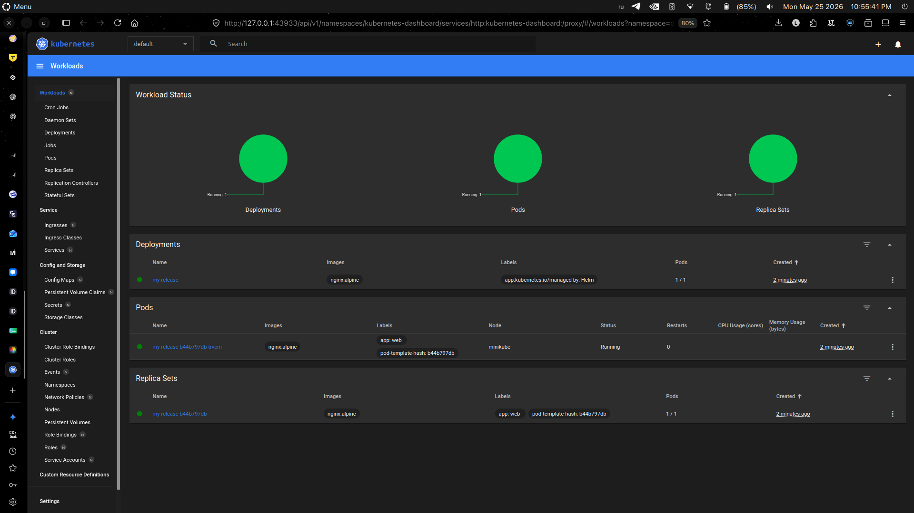
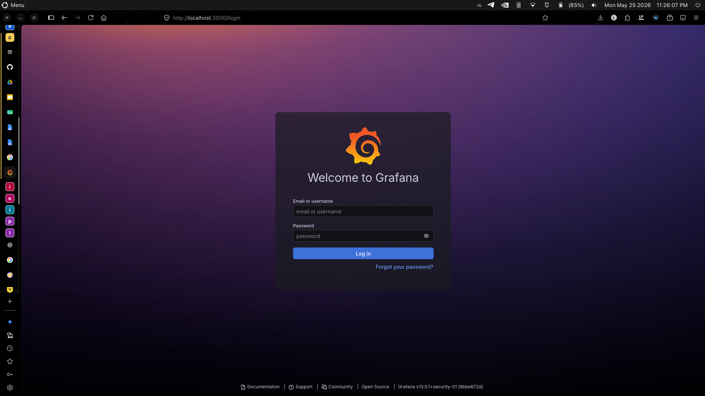
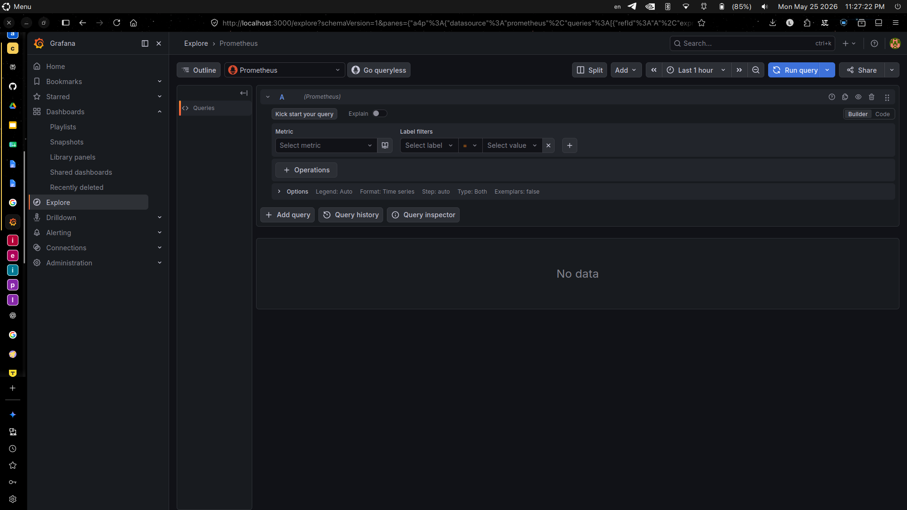
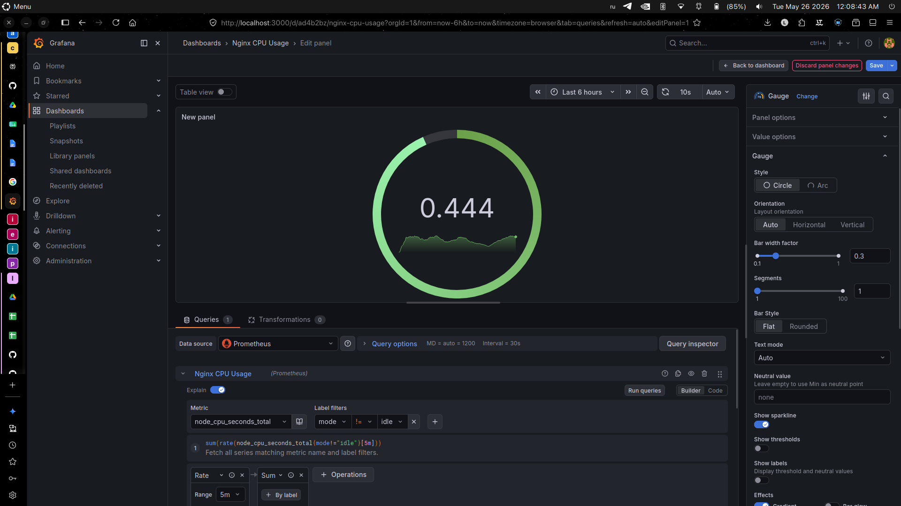
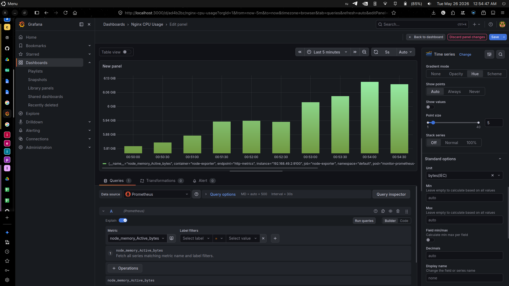
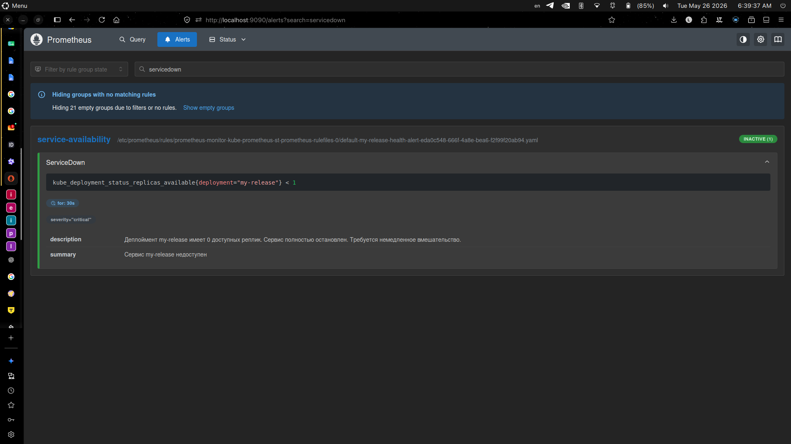
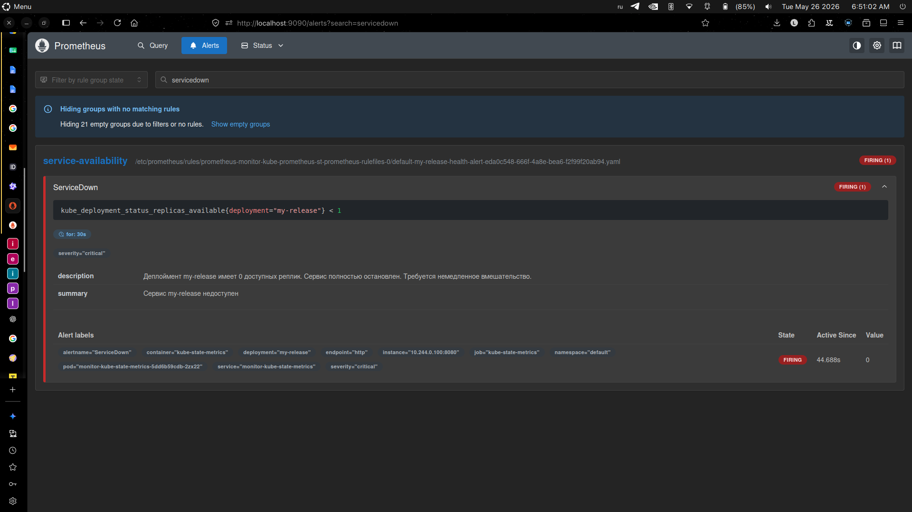
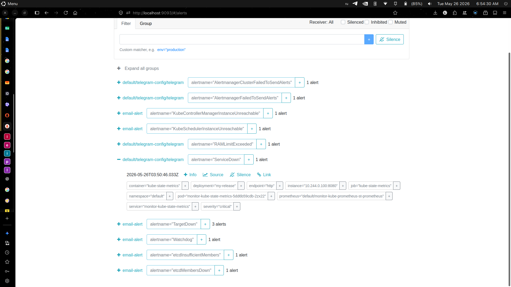
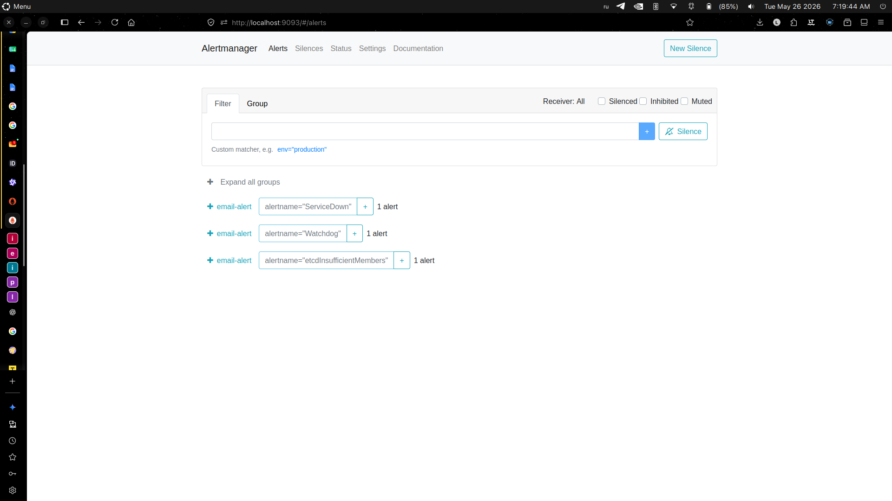
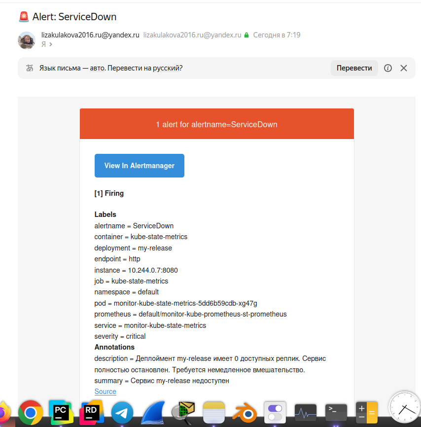

# Лабораторная работа №5. Мониторинг

## База
### 1 Поднятие сервиса в Kubernetes

Воспользуюсь своей же лабой 2, ровно по тому же алгоритму подниму свой сервис в Kubernetes, а потом уже буду его деплоить через Helm.

```
minikube start
cd kuber-lab
helm install my-release .
mibikube dashboard
```


Все миленько и уютненько, переходим к мониторингу!

### 2 Мониторинг с помощью grafana и prometheus

Установим нужные репозитории и чарты для `prometheus` и `grafana`:
```
helm repo add prometheus-community https://prometheus-community.github.io/helm-charts
"prometheus-community" has been added to your repositories
helm repo update
Hang tight while we grab the latest from your chart repositories...
...Successfully got an update from the "prometheus-community" chart repository
Update Complete. ⎈Happy Helming!⎈
helm install monitor prometheus-community/kube-prometheus-stack
NAME: monitor
LAST DEPLOYED: Mon May 25 23:05:00 2026
NAMESPACE: default
STATUS: deployed
REVISION: 1
TEST SUITE: None
NOTES:
kube-prometheus-stack has been installed. Check its status by running:
  kubectl --namespace default get pods -l "release=monitor"

Get Grafana 'admin' user password by running:

  kubectl --namespace default get secrets monitor-grafana -o jsonpath="{.data.admin-password}" | base64 -d ; echo

Access Grafana local instance:

  export POD_NAME=$(kubectl --namespace default get pod -l "app.kubernetes.io/name=grafana,app.kubernetes.io/instance=monitor" -oname)
  kubectl --namespace default port-forward $POD_NAME 3000

Get your grafana admin user password by running:

  kubectl get secret --namespace default -l app.kubernetes.io/component=admin-secret -o jsonpath="{.items[0].data.admin-password}" | base64 --decode ; echo


Visit https://github.com/prometheus-operator/kube-prometheus for instructions on how to create & configure Alertmanager and Prometheus instances using the Operator.

```

Чуть-чуть подождем инициализации подов:
```
kubectl get pods
NAME                                                     READY   STATUS    RESTARTS   AGE
alertmanager-monitor-kube-prometheus-st-alertmanager-0   2/2     Running   0          6m22s
monitor-grafana-7dbc9cd58b-56c5x                         3/3     Running   0          7m50s
monitor-kube-prometheus-st-operator-7c78c88786-929hw     1/1     Running   0          7m50s
monitor-kube-state-metrics-5dd6b59cdb-lv2sv              1/1     Running   0          7m50s
monitor-prometheus-node-exporter-zdk46                   1/1     Running   0          7m50s
my-release-b44b797db-trvcm                               1/1     Running   0          20m
prometheus-monitor-kube-prometheus-st-prometheus-0       2/2     Running   0          6m22s
```

Узнаем пароль от `grafana`:
```
kubectl --namespace default get secrets monitor-grafana -o jsonpath="{.data.admin-password}" | base64 -d ; echo
```

Портируем `grafana` на локальную машину:
```
export POD_NAME=$(kubectl --namespace default get pod -l "app.kubernetes.io/name=grafana,app.kubernetes.io/instance=monitor" -oname)
  kubectl --namespace default port-forward $POD_NAME 3000
```

По адресу `http://localhost:3000` открываем `grafana`, логинимся (логин: admin, пароль: тот, что мы получили в предыдущем пункте) и видим, что все работает!





### 3 Построение графиков с помощью Prometheus

В веб-интерфейсе `grafana` создаем новый дашборд и добавляем панель с графиком. В качестве источника данных выбираем `Prometheus`.

Первый график пусть будет о нагрузке CPU нашего сервиса:
- В качестве метрики выберем `node_cpu_seconds_total` - сколько всего секунд процессор потратил на выполнение задач;
- Режим ставим не равным `idle`, то есть считаем активное время работы CPU, а не время простоя;
- Агрегирующая функция `sum` поможет нам сложить все значения по всем нодам, чтобы увидеть общую нагрузку на кластер.
- Агрегирующая функция `rate` покажет нам скорость изменения метрики, то есть насколько быстро растет или падает нагрузка на CPU.
- Временное окно выберем равным 5 минутам, чтобы сгладить график и увидеть тренды, а не кратковременные всплески.

PromQL-запрос получился следующий: `sum(rate(node_cpu_seconds_total{mode!="idle"}[5m]))`



В момент, когда я открываю график, он показывает, что нагрузка на CPU в кластере минимальная, так как наш сервис не выполняет никаких задач. Суммарная полезная нагрузка на процессор внутри `Minikube` эквивалентна 44.4% от полной мощности одного процессорного ядра.

Всего ядер на мой кластер выделено 32:

```
kubectl get nodes -o jsonpath='{.items[*].status.capacity.cpu}'
32
```

Довольно простой, но занимательный график, который показывает использование RAM в кластере каждые 30 сек (`node_memory_Active_bytes` показывает объем оперативной памяти в байтах, которая прямо сейчас занята всеми работающими процессами и контейнерами в `Minikube`):



В боковой панели выбрала единицы измерения в байтах, чтобы график отображался в более удобном виде (ГБ). В момент открытия графика видно, что в кластере активно используется около 5.5 ГБ оперативной памяти, что может быть связано с работой `Prometheus`, `Grafana` и нашего тестового сервиса.

## Со звездочкой

### 4 Настройка алерта кодом IaaC

Создадим `alert-manager.yaml` для `Prometheus`, который будет содержать правила алертов. Давайте будем следить за количеством готовых реплик деплоймента `my-release`. Если количество доступных реплик будет меньше 1 в течение 30 секунд, то мы будем считать, что сервис недоступен и срабатывать алерту `ServiceDown`. Этот алерт будет иметь метку `severity: critical` и аннотацию с кратким описанием проблемы.

```
vim alert-manager.yaml
apiVersion: monitoring.coreos.com/v1
kind: PrometheusRule
metadata:
  name: my-release-health-alert
  labels:
    release: monitor
spec:
  groups:
  - name: service-availability
    rules:
    - alert: ServiceDown
      # Проверяем, что у деплоймента my-release нет доступных реплик
      expr: kube_deployment_status_replicas_available{deployment="my-release"} < 1
      for: 30s
      labels:
        severity: critical
      annotations:
        summary: "Сервис my-release недоступен"
        description: >
          Деплоймент my-release имеет 0 доступных реплик.
          Сервис полностью остановлен. Требуется немедленное вмешательство.
```

Так как `Prometheus` - сторонний объект, апи для него пришлось прописывать, чтобы миникуб знал, где искать. Здесь мы создаем алерт `RAMLimitExceeded` (`PrometheusRule` объект), который сработает, если активная память в кластере превысит 1 ГБ (1073741824 байт) в течение 10 секунд. Алерт будет иметь метку `severity: critical` и аннотацию с кратким описанием проблемы.

Применяем этот манифест в кластер:

```
kubectl apply -f alert-manager.yaml
prometheusrule.monitoring.coreos.com/my-release-health-alert created
```

Пробросим порт `Alertmanager` на локальную машину, чтобы видеть алерты в веб-интерфейсе:

```
kubectl port-forward svc/prometheus-operated 9090:9090
```

Открываем `http://localhost:9090/alerts` и видим, что алерт `ServiceDown` в статусе `inactive`, так как в данный момент количество реплик для деплоя - 1. 

```
kubectl get deploy my-release
NAME         READY   UP-TO-DATE   AVAILABLE   AGE
my-release   1/1     1            1           7h55m
```



Однако, если мы масштабируем деплоймент `my-release` до 0 реплик, то алерт перейдет в статус `firing`, что будет означать, что сервис недоступен:

```
kubectl scale deployment my-release --replicas=0
deployment.apps/my-release scaled
```


При этом, если мы снова масштабируем деплоймент `my-release` до 1 реплики, алерт вернется в статус `inactive`, так как сервис снова доступен:

```
kubectl scale deployment my-release --replicas=1
deployment.apps/my-release scaled
```

### 5 Уведомление в Telegram

Через `BotFather` создаем бота и получаем его токен. Затем, используя `curl`, отправляем сообщение в Telegram:

```
curl -X POST "https://api.telegram.org/bot<ТОКЕН_БОТА>/sendMessage" \
  -H "Content-Type: application/json" \
  -d '{
    "chat_id": "<ID_ЧАТА>",
    "text": "Привет! Это тестовое сообщение от моего бота в Telegram."
  }'
```


Создаем `alertmanager-tg.yaml` с настройками для отправки уведомлений в Telegram:
```
vim alertmanager-tg.yaml
alertmanager:
  config:
    global:
      resolve_timeout: 1m
    route:
      receiver: 'telegram-alert'
      group_by: ['alertname']
      group_wait: 10s
    receivers:
      - name: 'telegram-alert'
        telegram_configs:
          - api_url: 'https://api.telegram.org'
            bot_token: 'token_бота'
            chat_id: chat_id
            parse_mode: 'HTML'
            disable_notifications: false
```

Применим новые настройки мониторинга:

```
helm upgrade monitor prometheus-community/kube-prometheus-stack \
  -f alertmanager-tg.yaml
Release "monitor" has been upgraded. Happy Helming!
NAME: monitor
LAST DEPLOYED: Tue May 26 02:08:34 2026
NAMESPACE: default
STATUS: deployed
REVISION: 2
TEST SUITE: None
NOTES:
kube-prometheus-stack has been installed. Check its status by running:
  kubectl --namespace default get pods -l "release=monitor"

Get Grafana 'admin' user password by running:

  kubectl --namespace default get secrets monitor-grafana -o jsonpath="{.data.admin-password}" | base64 -d ; echo

Access Grafana local instance:

  export POD_NAME=$(kubectl --namespace default get pod -l "app.kubernetes.io/name=grafana,app.kubernetes.io/instance=monitor" -oname)
  kubectl --namespace default port-forward $POD_NAME 3000

Get your grafana admin user password by running:

  kubectl get secret --namespace default -l app.kubernetes.io/component=admin-secret -o jsonpath="{.items[0].data.admin-password}" | base64 --decode ; echo


Visit https://github.com/prometheus-operator/kube-prometheus for instructions on how to create & configure Alertmanager and Prometheus instances using the Operator.
```

Прокинем порт и посмотрим, действительно ли алерты работают:

```
kubectl port-forward svc/monitor-kube-prometheus-alertmanager 9093:9093
```



Да, алерт есть!

Но из-за ограничений и блокировок со стороны Telegram, я не могу протестировать отправку уведомлений в Telegram. Поэтому я не могу показать скриншот с уведомлением в Telegram, но код для настройки алерта и отправки уведомлений в Telegram я предоставил выше.
Логи подтверждают, что попытка отправить алерт в Telegram была предпринята, но из-за блокировки со стороны Telegram, сообщение не было доставлено. В реальной ситуации, если бы Telegram не блокировал эти запросы, мы бы получили уведомление в нашем чате с ботом.

```
kubectl logs -l app.kubernetes.io/name=alertmanager -f --tail=30
liza@liza-ai-pc:~/work/itmo/devops/devops-labs/lab5_monitoring/kuber-lab$ kubectl logs -l app.kubernetes.io/name=alertmanager -f --tail=30
time=2026-05-26T03:35:43.529Z level=ERROR source=dispatch.go:603 msg="Notify for alerts failed" component=dispatcher aggrGroup="{}/{namespace=\"default\"}:{alertname=\"AlertmanagerClusterFailedToSendAlerts\"}" num_alerts=1 err="default/telegram-config/telegram/telegram[0]: notify retry canceled after 1 attempts: context deadline exceeded"
time=2026-05-26T03:36:57.258Z level=ERROR source=dispatch.go:603 msg="Notify for alerts failed" component=dispatcher aggrGroup="{}/{namespace=\"default\"}:{alertname=\"RAMLimitExceeded\"}" num_alerts=1 err="default/telegram-config/telegram/telegram[0]: notify retry canceled after 1 attempts: context deadline exceeded"
time=2026-05-26T03:37:58.697Z level=ERROR source=dispatch.go:603 msg="Notify for alerts failed" component=dispatcher aggrGroup="{}/{namespace=\"default\"}:{alertname=\"AlertmanagerFailedToSendAlerts\"}" num_alerts=1 err="default/telegram-config/telegram/telegram[0]: notify retry canceled after 1 attempts: context deadline exceeded"
time=2026-05-26T03:37:58.697Z level=ERROR source=dispatch.go:603 msg="Notify for alerts failed" component=dispatcher aggrGroup="{}/{namespace=\"default\"}:{alertname=\"AlertmanagerClusterFailedToSendAlerts\"}" num_alerts=1 err="default/telegram-config/telegram/telegram[0]: notify retry canceled after 1 attempts: context deadline exceeded"
time=2026-05-26T03:39:12.426Z level=ERROR source=dispatch.go:603 msg="Notify for alerts failed" component=dispatcher aggrGroup="{}/{namespace=\"default\"}:{alertname=\"RAMLimitExceeded\"}" num_alerts=1 err="default/telegram-config/telegram/telegram[0]: notify retry canceled after 1 attempts: context deadline exceeded"
time=2026-05-26T03:40:13.865Z level=ERROR source=dispatch.go:603 msg="Notify for alerts failed" component=dispatcher aggrGroup="{}/{namespace=\"default\"}:{alertname=\"AlertmanagerFailedToSendAlerts\"}" num_alerts=1 err="default/telegram-config/telegram/telegram[0]: notify retry canceled after 1 attempts: context deadline exceeded"
time=2026-05-26T03:40:13.866Z level=ERROR source=dispatch.go:603 msg="Notify for alerts failed" component=dispatcher aggrGroup="{}/{namespace=\"default\"}:{alertname=\"AlertmanagerClusterFailedToSendAlerts\"}" num_alerts=1 err="default/telegram-config/telegram/telegram[0]: notify retry canceled after 1 attempts: context deadline exceeded"
time=2026-05-26T03:41:27.593Z level=ERROR source=dispatch.go:603 msg="Notify for alerts failed" component=dispatcher aggrGroup="{}/{namespace=\"default\"}:{alertname=\"RAMLimitExceeded\"}" num_alerts=1 err="default/telegram-config/telegram/telegram[0]: notify retry canceled after 1 attempts: context deadline exceeded"
time=2026-05-26T03:42:29.033Z level=ERROR source=dispatch.go:603 msg="Notify for alerts failed" component=dispatcher aggrGroup="{}/{namespace=\"default\"}:{alertname=\"AlertmanagerClusterFailedToSendAlerts\"}" num_alerts=1 err="default/telegram-config/telegram/telegram[0]: notify retry canceled after 1 attempts: context deadline exceeded"
time=2026-05-26T03:42:29.033Z level=ERROR source=dispatch.go:603 msg="Notify for alerts failed" component=dispatcher aggrGroup="{}/{namespace=\"default\"}:{alertname=\"AlertmanagerFailedToSendAlerts\"}" num_alerts=1 err="default/telegram-config/telegram/telegram[0]: notify retry canceled after 1 attempts: context deadline exceeded"
time=2026-05-26T03:43:42.761Z level=ERROR source=dispatch.go:603 msg="Notify for alerts failed" component=dispatcher aggrGroup="{}/{namespace=\"default\"}:{alertname=\"RAMLimitExceeded\"}" num_alerts=1 err="default/telegram-config/telegram/telegram[0]: notify retry canceled after 1 attempts: context deadline exceeded"
time=2026-05-26T03:44:44.201Z level=ERROR source=dispatch.go:603 msg="Notify for alerts failed" component=dispatcher aggrGroup="{}/{namespace=\"default\"}:{alertname=\"AlertmanagerClusterFailedToSendAlerts\"}" num_alerts=1 err="default/telegram-config/telegram/telegram[0]: notify retry canceled after 1 attempts: context deadline exceeded"
time=2026-05-26T03:44:44.202Z level=ERROR source=dispatch.go:603 msg="Notify for alerts failed" component=dispatcher aggrGroup="{}/{namespace=\"default\"}:{alertname=\"AlertmanagerFailedToSendAlerts\"}" num_alerts=1 err="default/telegram-config/telegram/telegram[0]: notify retry canceled after 1 attempts: context deadline exceeded"
time=2026-05-26T03:45:57.929Z level=ERROR source=dispatch.go:603 msg="Notify for alerts failed" component=dispatcher aggrGroup="{}/{namespace=\"default\"}:{alertname=\"RAMLimitExceeded\"}" num_alerts=1 err="default/telegram-config/telegram/telegram[0]: notify retry canceled after 1 attempts: context deadline exceeded"
time=2026-05-26T03:46:59.369Z level=ERROR source=dispatch.go:603 msg="Notify for alerts failed" component=dispatcher aggrGroup="{}/{namespace=\"default\"}:{alertname=\"AlertmanagerClusterFailedToSendAlerts\"}" num_alerts=1 err="default/telegram-config/telegram/telegram[0]: notify retry canceled after 1 attempts: context deadline exceeded"
time=2026-05-26T03:46:59.369Z level=ERROR source=dispatch.go:603 msg="Notify for alerts failed" component=dispatcher aggrGroup="{}/{namespace=\"default\"}:{alertname=\"AlertmanagerFailedToSendAlerts\"}" num_alerts=1 err="default/telegram-config/telegram/telegram[0]: notify retry canceled after 1 attempts: context deadline exceeded"
time=2026-05-26T03:48:13.097Z level=ERROR source=dispatch.go:603 msg="Notify for alerts failed" component=dispatcher aggrGroup="{}/{namespace=\"default\"}:{alertname=\"RAMLimitExceeded\"}" num_alerts=1 err="default/telegram-config/telegram/telegram[0]: notify retry canceled after 1 attempts: context deadline exceeded"
time=2026-05-26T03:49:14.537Z level=ERROR source=dispatch.go:603 msg="Notify for alerts failed" component=dispatcher aggrGroup="{}/{namespace=\"default\"}:{alertname=\"AlertmanagerClusterFailedToSendAlerts\"}" num_alerts=1 err="default/telegram-config/telegram/telegram[0]: notify retry canceled after 1 attempts: context deadline exceeded"
time=2026-05-26T03:49:14.537Z level=ERROR source=dispatch.go:603 msg="Notify for alerts failed" component=dispatcher aggrGroup="{}/{namespace=\"default\"}:{alertname=\"AlertmanagerFailedToSendAlerts\"}" num_alerts=1 err="default/telegram-config/telegram/telegram[0]: notify retry canceled after 1 attempts: context deadline exceeded"
time=2026-05-26T03:50:28.265Z level=ERROR source=dispatch.go:603 msg="Notify for alerts failed" component=dispatcher aggrGroup="{}/{namespace=\"default\"}:{alertname=\"RAMLimitExceeded\"}" num_alerts=1 err="default/telegram-config/telegram/telegram[0]: notify retry canceled after 1 attempts: context deadline exceeded"
time=2026-05-26T03:51:29.706Z level=ERROR source=dispatch.go:603 msg="Notify for alerts failed" component=dispatcher aggrGroup="{}/{namespace=\"default\"}:{alertname=\"AlertmanagerFailedToSendAlerts\"}" num_alerts=1 err="default/telegram-config/telegram/telegram[0]: notify retry canceled after 1 attempts: context deadline exceeded"
time=2026-05-26T03:51:29.706Z level=ERROR source=dispatch.go:603 msg="Notify for alerts failed" component=dispatcher aggrGroup="{}/{namespace=\"default\"}:{alertname=\"AlertmanagerClusterFailedToSendAlerts\"}" num_alerts=1 err="default/telegram-config/telegram/telegram[0]: notify retry canceled after 1 attempts: context deadline exceeded"
time=2026-05-26T03:52:43.433Z level=ERROR source=dispatch.go:603 msg="Notify for alerts failed" component=dispatcher aggrGroup="{}/{namespace=\"default\"}:{alertname=\"RAMLimitExceeded\"}" num_alerts=1 err="default/telegram-config/telegram/telegram[0]: notify retry canceled after 1 attempts: context deadline exceeded"
time=2026-05-26T03:53:03.913Z level=ERROR source=dispatch.go:603 msg="Notify for alerts failed" component=dispatcher aggrGroup="{}/{namespace=\"default\"}:{alertname=\"ServiceDown\"}" num_alerts=1 err="default/telegram-config/telegram/telegram[0]: notify retry canceled after 1 attempts: context deadline exceeded"
time=2026-05-26T03:53:44.873Z level=ERROR source=dispatch.go:603 msg="Notify for alerts failed" component=dispatcher aggrGroup="{}/{namespace=\"default\"}:{alertname=\"AlertmanagerClusterFailedToSendAlerts\"}" num_alerts=1 err="default/telegram-config/telegram/telegram[0]: notify retry canceled after 1 attempts: context deadline exceeded"
time=2026-05-26T03:53:44.873Z level=ERROR source=dispatch.go:603 msg="Notify for alerts failed" component=dispatcher aggrGroup="{}/{namespace=\"default\"}:{alertname=\"AlertmanagerFailedToSendAlerts\"}" num_alerts=1 err="default/telegram-config/telegram/telegram[0]: notify retry canceled after 1 attempts: context deadline exceeded"
time=2026-05-26T03:54:58.601Z level=ERROR source=dispatch.go:603 msg="Notify for alerts failed" component=dispatcher aggrGroup="{}/{namespace=\"default\"}:{alertname=\"RAMLimitExceeded\"}" num_alerts=1 err="default/telegram-config/telegram/telegram[0]: notify retry canceled after 1 attempts: context deadline exceeded"
time=2026-05-26T03:55:19.081Z level=ERROR source=dispatch.go:603 msg="Notify for alerts failed" component=dispatcher aggrGroup="{}/{namespace=\"default\"}:{alertname=\"ServiceDown\"}" num_alerts=1 err="default/telegram-config/telegram/telegram[0]: notify retry canceled after 1 attempts: context deadline exceeded"
time=2026-05-26T03:56:00.041Z level=ERROR source=dispatch.go:603 msg="Notify for alerts failed" component=dispatcher aggrGroup="{}/{namespace=\"default\"}:{alertname=\"AlertmanagerFailedToSendAlerts\"}" num_alerts=1 err="default/telegram-config/telegram/telegram[0]: notify retry canceled after 1 attempts: context deadline exceeded"
time=2026-05-26T03:56:00.041Z level=ERROR source=dispatch.go:603 msg="Notify for alerts failed" component=dispatcher aggrGroup="{}/{namespace=\"default\"}:{alertname=\"AlertmanagerClusterFailedToSendAlerts\"}" num_alerts=1 err="default/telegram-config/telegram/telegram[0]: notify retry canceled after 1 attempts: context deadline exceeded"
```

Не сдаемся и пробуем почту:

```
vim alertmanager-mai.yaml
alertmanager:
  config:
    global:
      resolve_timeout: 1m
      smtp_smarthost: 'smtp.yandex.ru:587'
      smtp_from: 'почта@домен.ru'
      smtp_auth_username: 'почта@домен.ru'
      smtp_auth_password: 'пароль_приложения'
      smtp_require_tls: true
    
    route:
      receiver: 'email-alert'
      group_by: ['alertname']
      group_wait: 10s
      group_interval: 10s
      repeat_interval: 5m
    
    receivers:
      - name: 'email-alert'
        email_configs:
          - to: 'почта@домен.ru'
            send_resolved: true
            headers:
              Subject: '🚨 Alert: {{ .CommonLabels.alertname }}'
```

Прокинем порт и посмотрим, действительно ли алерты работают:

```
kubectl port-forward svc/monitor-kube-prometheus-alertmanager 9093:9093
```





Да, алерты есть!
Система мониторинга развёрнута в Kubernetes (Minikube) с использованием `kube-prometheus-stack`. Настроены два графика в `Grafana`: нагрузка на CPU (sum(rate(node_cpu_seconds_total{mode!="idle"}[5m]))) и использование RAM (node_memory_Active_bytes). Алерт `ServiceDown` реализован кодом через PrometheusRule (IaC) и срабатывает при отсутствии реплик для деплоя. Уведомления настроены через Alertmanager с отправкой на email через SMTP Yandex. При тестировании успешно получены уведомления о срабатывании алертов (`Watchdog`, `TargetDown`, `etcdInsufficientMembers`), что подтверждает работоспособность всей цепочки: Prometheus → Alertmanager → SMTP → Email. Кастомный алерт `ServiceDown` переходит в статус firing при 0 реплик; из-за наличия дефолтных маршрутов в конфигурации Alertmanager уведомления могут дублироваться в несуществующие каналы (Telegram), что не влияет на доставку в основной канал (email). Поэтому пришлось удалять ноду миникуба, заново все поднимать, и все заработало!